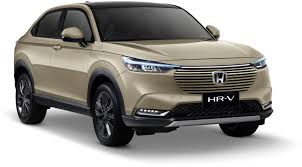
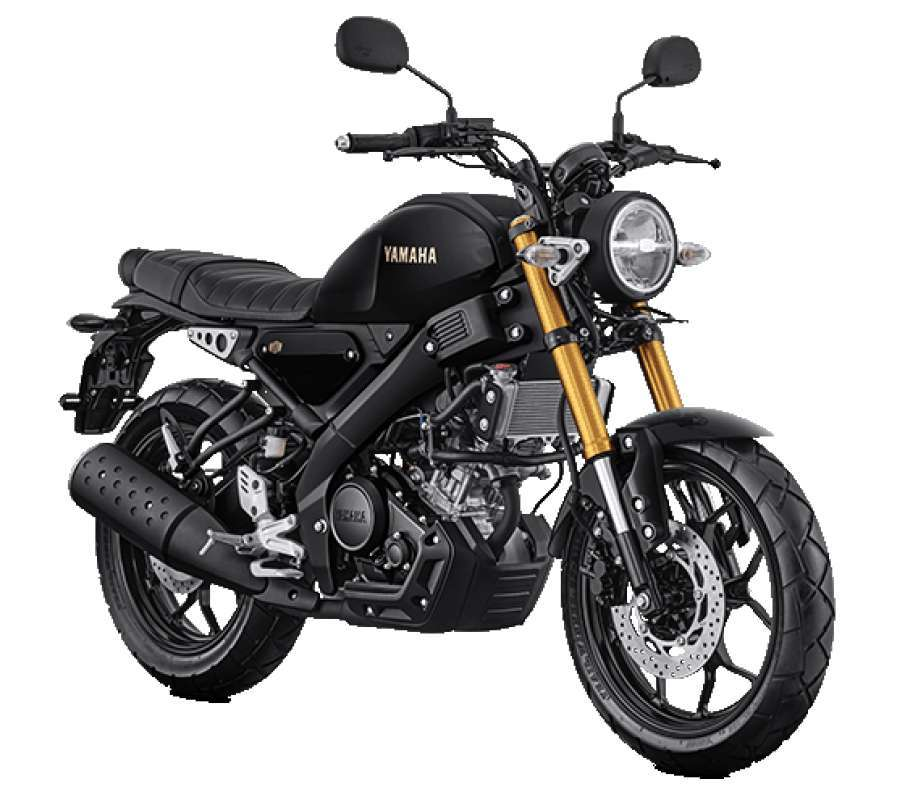

# 🚗🏍️ Klasifikasi Gambar Mobil vs Motor dengan CNN dan Streamlit

Aplikasi ini menggunakan model **Convolutional Neural Network (CNN)** untuk mengklasifikasikan gambar sebagai **Mobil (Car)** atau **Motor (Bike)**. Proyek ini terdiri dari dua bagian utama:

---

## 🛠️ 1. Pelatihan Model: Google Colab

Model dilatih menggunakan **Google Colab** yang menyediakan GPU gratis, memanfaatkan dataset berisi 2020 gambar mobil dan 2020 gambar motor.  
Model CNN dilengkapi dengan fitur-fitur seperti:
- **Dropout** (mengurangi overfitting)
- **Batch Normalization**
- **Hyperparameter Tuning** dengan **Keras Tuner**

Setelah training selesai, model disimpan dalam format `.h5` dan digunakan oleh aplikasi web Streamlit.

🔗 **Link Google Colab (source training):**  
[https://colab.research.google.com/drive/1cBJhc6zJOagLOi9kRnPuESV1QYQr3osm?usp=sharing](https://colab.research.google.com/drive/1cBJhc6zJOagLOi9kRnPuESV1QYQr3osm?usp=sharing)

---

## 🌐 2. Aplikasi Web: Streamlit

Model hasil training (.h5) kemudian diintegrasikan ke dalam aplikasi web menggunakan **Streamlit**, yang memungkinkan pengguna meng-upload gambar dan melihat hasil prediksi secara langsung.

[Open App Preview](https://optimization-model-ai.streamlit.app/)

---

## 🖼️ Contoh Prediksi

| Gambar | Prediksi |
|--------|----------|
|  | Mobil 🚗 |
|  | Motor 🏍️ |

---

## 🚀 Cara Menjalankan Aplikasi

1. Clone repositori
   ```bash
   git clone https://github.com/awildan/optimization-model-ai.git
   cd optimization-model-ai
   ```

2. Install the requirements

   ```bash
   $ pip install -r requirements.txt
   ```

3. Run the app

   ```bash
   $ streamlit run streamlit_app.py
   ```
   
## 📁 Struktur Folder
```
.
├── streamlit_app.py        # Aplikasi Streamlit
├── car_bike_model_best.h5  # Model CNN hasil training dari Google Colab
├── requirements.txt        # Daftar dependensi
└── README.md
```

## 📘 Dokumentasi
[Dokumentasi Project CNN: Klasifikasi Mobil vs Motor](https://www.notion.so/Dokumentasi-Project-CNN-Klasifikasi-Mobil-vs-Motor-1e804ce89ecd805882d7e15d5e819224?pvs=4)
